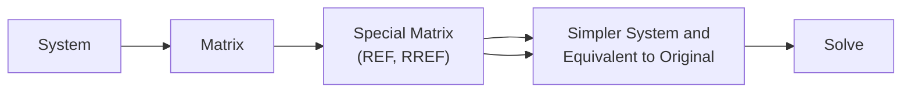

## Consistency of Linear System
$$\begin{cases}2x_1+3x_2-x_3+4x_4=11 \\ -3x_1+x_2+2x_3-x_4=0 \\ 4x_1-2x_2+x_3+3x_4=4\end{cases}$$
	This linear system is "**consistent**" because $(x_1,x_2,x_3,x_4)=(1,2,1,1)$ is a solution. How do we know that it's the solution? Because if we evaluate these values into each row linear equations it would satisfy all the equations in the system. We verify the consistency by evaluating the solution values below: $$\begin{array}2(1)+3(2)-(1)+4(1)=11\\ -3(1)+(2)-2(1)-(1)=0 \\ 4(1)-2(2)+(1)+3(1)=4\end{array}$$A system is also referred to as "**consistent**" if there is atleast 1 or more solution. It is only "**inconsistent**" IF it has no solution. Hence, the table below summarizes the conditions.

| Type         | No. of Solutions |
| ------------ | ---------------- |
| Inconsistent | $0$              |
| Consistent   | $>=1$            |
	Another case is the system, $$\begin{cases}x+y=2 \\ 2x+2y=3\end{cases}$$which is inconsistent because it has no solutions. We can verify this by visualizing through graph or by analyzing both equations in which we can divide both sides by 2 in the 2nd equation of the system $$\frac{\cancel{2}x+\cancel{2}y}{\cancel{2}}=\frac{3}{2}\to x+y=\frac{3}{2}$$hence multiple values or solutions of $x+y$, is not valid and impossible. 
	In system of linear equations, it always represents a line if there's two variables and the solution is the point of intersection which is both the $x$ and $y$-intercept. To visualize, $x+y=2$ is
	<iframe src="https://www.desmos.com/calculator/eenbozxp6n?embed" width="600" height="280" style="border: 1px solid #ccc; border-radius: 0.785em;" frameborder=0></iframe>

## Homogenous
Every homogeneous linear system always has at least one solution.

$$\begin{cases}a_{11}x_1+a_{12}x_2+\cdots+a_{1n}x_n=b_1 \\ a_{21}x_1+a_{22}x_2+\cdots+a_{2n}x_n=b_2 \\ \vdots \\ a_{i1}x_1+a_{i2}x_2+\cdots+a_{in}x_n=b_i \\ \vdots\\ a_{m1}x_1+a_{m2}x_2+\cdots+a_{mn}x_n=b_m\end{cases}$$
If all the values of the equations in the system are 0 then it is "homogenous". $$b_1=b_2=\cdots=b_m=0$$An example of a homogenous linear system is $$\begin{cases}2x_1+x_2-x_3=0 \\ x_2+x_3 = 0\\ x_1+x_2+x_3=0\end{cases}$$It's homogenous because the right hand side is 0. All homogenous linear systems are always "consistent" and its solution is "trivial solution". Trivial solution means all values of the solution is 0, therefore its equivalent to $$(x_1,x_2,x_3,\cdots,x_n)=(0,0,0,\cdots,0)$$In contrast, there is also called "**nontrivial solution**" which means that not all of the values in the solution are 0.

Moreover, if two systems of equations have exactly the same solutions, thus it is called "**equivalent**".

## Solving Process

### Sample Problem #1
$$\begin{cases}2x_1+3x_2-x_3+4x_4=11 \\ -3x_1+x_2+2x_3-x_4=0 \\ 4x_1-2x_2+x_3+3x_4=4\end{cases}$$$$A=\begin{bmatrix}2&3&-1&4\\-3&1&2&-1\\4&-2&1&3\end{bmatrix},x=\begin{bmatrix}x_1\\x_2\\x_3\\x_4\end{bmatrix},b=\begin{bmatrix}11\\0\\4\end{bmatrix}$$which $x$ represents the variables and $b$ represents the right hand side.

The linear system can be written to "**Matrix Form**" $$Ax=b$$ $$A=\begin{bmatrix}2&3&-1&4\\-3&1&2&-1\\4&-2&1&3\end{bmatrix}\begin{bmatrix}x_1\\x_2\\x_3\\x_4\end{bmatrix}=\begin{bmatrix}11\\0\\4\end{bmatrix},A=\text{3x4},x=\text{4x1}$$
> [!info]
>  The $A$ stands for "**Coefficient Matrix**".

#### Augmented Matrix
$$\left[\begin{array}{cccc|c}
2&3&-1&4&11\\-3&1&2&-1&0\\4&-2&1&3&4
\end{array}\right]$$

### Sample Problem #2
$$\begin{cases}2x_1+x_2-x_3=0 \\ 0x_1+x_2+x_3=0 \\ x_1+x_2+x_3=0\end{cases}$$
$$A=\begin{bmatrix}2&1&-1\\0&1&1\\1&1&1\end{bmatrix},x=\begin{bmatrix}x_1\\x_2\\x_3\end{bmatrix},b=\begin{bmatrix}0\\0\\0\end{bmatrix}$$

#### Augmented Matrix
$$\left[\begin{array}{ccc|c}
2&1&-1&0\\0&1&1&0\\1&1&1&0
\end{array}\right]$$

### Reduced Row Echelon Form (RREF)
REF or RREF applies to any matrices of any size.
Echelon means "ranks" or "levels"

**Properties of RREF to Determine**
1. All zero rows appear at the bottom of the matrix
2. Non-zero entries from the left leading must be 1. (Leading One Entry)
3. Non-zero entries must have a leading one that appears to the right below any leading ones in preceding rows.
4. All columns that contains a leading one must have complete zero entries below the leading one.

If the properties follow only 1, 2, and 3, it is considered as "**Row Echelon Form (REF)**".

## Sample Problems (Row Echelon Forms)
**Determine whether the given matrix is in RREF, REF only, or none of the above.**

1. $\begin{bmatrix}1&2&0&3&5\\0&1&4&2&1\\0&0&1&0&0\\0&0&0&0&-1\\0&0&0&0&0\end{bmatrix}=\text{NONE, 4th row contains -1}$
2. $\begin{bmatrix}1&0&0&2\\0&1&0&-1\\0&0&0&1\\0&0&0&0\\0&0&0&0\\0&0&0&0\end{bmatrix}=\text{REF, 4th column has non-zero}$
3. $\begin{bmatrix}1&2&0&3&5\\0&1&4&2&1\\0&0&1&-1&0\\0&0&0&0&2\\0&0&0&0&0\end{bmatrix}=\text{NONE, 4th row contains 2}$
4. $\begin{bmatrix}0&0&0&0\\1&0&2&5\\0&1&-1&3\end{bmatrix}=\text{NONE, violates first rule}$
5. $\begin{bmatrix}1&2&3&4\\0&1&5&6\\0&0&0&7\\0&0&0&0\end{bmatrix}=\text{NONE, violates second rule}$
6. $\begin{bmatrix}1&0&-1&0\\0&1&1&3\end{bmatrix}=\text{RREF}$
	

## Inverse Matrix
### 1x1 Matrix
### 2x2 Matrix
### nxn Matrix

---

## Summary
- Consistent and Inconsistent Equation Type
- Homogenous Linear Equation System
- Trivial and Nontrivial Solution
- Equivalent Systems of Equation
- Matrix Form ($A$, $x$, and $b$)
- Coefficient Matrix, Augmented Matrix, Reduced Row Echelon Form (RREF), Row Echelon Form (REF), and its REF Properties
- Inverse Matrix
- Elementary Row Operations (Type I, Type II, Type III)
- Partitions in Augmented Matrix
	- Partitions are the separated area in an augmented matrix, it refers to the left and right partitions.

# Gaussian Elimination
# Gauss-Jordan Reduction

